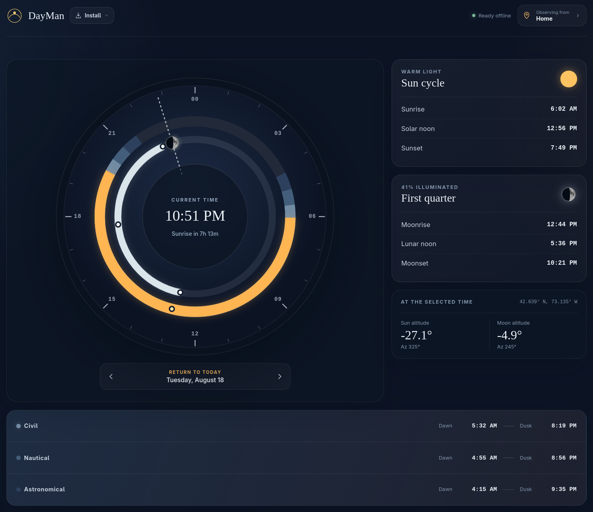

# DayMan
*Will a full moon rise at 2am and shine through your window? How long until it's too dark to run without a headlamp? DayMan can tell you when the nightman cometh.*

DayMan is an installable, offline-first web app that presents the Sun and Moon
around a 24-hour dial for a chosen location and date. Install as a PWA or if you'd like a widget, download the native app for Android, macOS, or Linux.

## Install

- **Web / PWA:** Visit [DayMan on the web](https://glen.industries/DayMan/), select **Install**, and follow the browser prompt (or use **Install app** / **Add to Home Screen** from the browser menu).
- **Android:** From the [latest release](https://github.com/glengerbush/DayMan/releases/latest), download the `.apk`, open it, and approve installation from your browser or file manager if prompted.
- **macOS:** From the [latest release](https://github.com/glengerbush/DayMan/releases/latest), download the `.dmg`, drag DayMan into **Applications**, run `xattr -cr /Applications/DayMan.app`, and then open it once so macOS can register the bundled widget extension. The widget is included with the app and is not installed separately.
- **Linux (any distribution):** From the [latest release](https://github.com/glengerbush/DayMan/releases/latest), download the `.AppImage`, make it executable, and run it.
- **Debian / Ubuntu:** Download the `.deb` from the [latest release](https://github.com/glengerbush/DayMan/releases/latest) and open it with your software installer.
- **Fedora:** Download the `.rpm` from the [latest release](https://github.com/glengerbush/DayMan/releases/latest) and open it with your software installer.
- **Arch Linux:** Download the `.pkg.tar.zst` from the [latest release](https://github.com/glengerbush/DayMan/releases/latest) and install it with `sudo pacman -U ./dayman-*.pkg.tar.zst`.

## Tech Stack

- [Svelte 5](https://svelte.dev/), [TypeScript](https://www.typescriptlang.org/),
  and [Vite](https://vite.dev/)
- [Astronomy Engine](https://github.com/cosinekitty/astronomy) for Sun and
  Moon calculations
- [`tz-lookup`](https://github.com/darkskyapp/tz-lookup) for
  coordinate-to-time-zone selection
- [MapLibre GL JS](https://maplibre.org/maplibre-gl-js/docs/) with
  [OpenStreetMap](https://www.openstreetmap.org/) tiles
- Official 2025 U.S. Census ZCTA representative coordinates, transformed into
  `public/data/zcta-2025.json`
- [`vite-plugin-pwa`](https://vite-pwa-org.netlify.app/) with
  [Workbox](https://developer.chrome.com/docs/workbox/) for installation and
  offline caching

See `public/data/README.md` for the ZIP dataset source and transformation notes.
See [docs/platform-release-plan.md](docs/platform-release-plan.md) for the PWA
release checklist and the implemented Android, macOS, and Linux widget
pathway. The shared native state format is documented in
[docs/clock-snapshot-contract.md](docs/clock-snapshot-contract.md). Maintainer
instructions for tag releases are in
[docs/release-workflow.md](docs/release-workflow.md).

Heavily inspired by [Sundial](https://sundialapp.com/). I missed having this app so much, after moving away from iOS, that I had to make a replacement that works on Android. If you have an iPhone, you should check Sundial.
